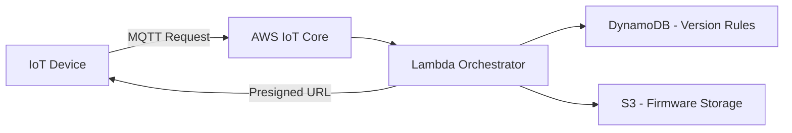

> 🚀 Real-world inspired IoT OTA firmware orchestration system built using AWS serverless architecture and Terraform

Legacy IP modules running on v5 firmware (TURN-based architecture) require a staged bridge upgrade (v5.6.30) to safely transition into a modern MQTT-based AWS IoT infrastructure (v6), ensuring compatibility and continuity.

# 🚀 IoT Firmware Orchestration Service (OTA Upgrade System)

## 📌 Overview

Designed and conceptualized a cloud-native firmware orchestration system to manage **Over-the-Air (OTA) updates** for IoT alarm panel modules.

This project is based on **real-world field challenges**, where firmware upgrades require **strict version sequencing** and must handle **delayed artifact availability** due to storage lifecycle policies.

---

## 💼 Why This Project Matters

This project is inspired by real-world field scenarios involving IoT alarm systems, where firmware upgrades must be carefully orchestrated to avoid device failure and service disruption.

It demonstrates the ability to translate operational challenges into scalable cloud-native solutions using AWS and Infrastructure as Code.

---

## 🧠 Real-World Problem

In production environments, IoT modules cannot always upgrade directly to the latest firmware.

### Example Upgrade Path:

```text
v5.6.14 (TURN) → v5.6.30 → v6.15.008 (MQTT)
```

### Key Constraints:

* Sequential upgrade required (no direct jump)
* Devices must maintain connectivity during transition
* Firmware availability may be delayed due to storage tiering

---

## ⚠️ Challenges Observed

### 1. Firmware Dependency Sequencing

* Devices require intermediate firmware versions
* Incorrect upgrade path can cause:

  * Device failure
  * Loss of communication
  * Rollback complexity

---

### 2. Delayed Firmware Availability

* Firmware artifacts occasionally not immediately available
* Observed delay: **1–2 hours**

#### Root Cause (Analysis):

* Likely due to **S3 lifecycle policies**
* Objects stored in **cold storage (e.g., Glacier tiers)**
* Retrieval introduces latency

---

### 3. Scalable Device Coordination

* Multiple devices requesting updates simultaneously
* Need for:

  * Controlled rollout
  * Retry mechanisms
  * State tracking

---

## 🏗️ Architecture



---

## 🔧 Solution Design

### 🔹 AWS IoT Core (MQTT Communication)

* Devices publish firmware update requests
* Event-driven architecture ensures scalability

---

### 🔹 Lambda Orchestrator

* Evaluates current firmware version
* Determines next upgrade step
* Enforces sequential upgrade path
* Acts as the decision engine for firmware progression logic

---

### 🔹 DynamoDB (Optional Enhancement)

* Stores firmware version mappings
* Enables dynamic upgrade path resolution

---

### 🔹 Amazon S3 (Firmware Storage)

* Stores firmware binaries
* Lifecycle policies applied for cost optimization

---

### 🔹 Presigned URLs

* Secure, time-limited firmware download links
* Eliminates need for public access

---

## 🔁 Handling Delayed Firmware Retrieval

To address cold storage latency:

* Retry mechanism with exponential backoff
* Firmware availability check before issuing download
* Optional pre-fetch strategy for active firmware versions
* Graceful fallback if firmware is temporarily unavailable

---

## ⚙️ Features

* ✅ Sequential firmware upgrade enforcement
* ✅ Event-driven serverless architecture
* ✅ Secure firmware distribution
* ✅ Resilient retry handling
* ✅ Scalable for large IoT fleets

---

## 📊 Observability Considerations

* CloudWatch metrics and alarms can monitor firmware request failures
* Lambda logging enables debugging of upgrade workflows
* SNS alerts can notify operators of failed upgrade attempts

---

## 🧠 Technical Insights

* Storage lifecycle policies can impact **real-time systems**
* Serverless orchestration simplifies OTA workflows
* MQTT enables efficient device communication at scale

---

## 🏗️ Terraform Implementation

Infrastructure is provisioned using Terraform:

* AWS IoT Core resources
* Lambda function
* S3 bucket (firmware storage)
* IAM roles and policies
* (Optional) DynamoDB table

---

## 📂 Repository Structure

```bash
iot-firmware-orchestration-service/
│
├── README.md
├── terraform/
├── lambda/
└── architecture/
```

---

## 💼 Key Outcomes

This project demonstrates:

* Real-world problem-solving in IoT environments
* Cloud-native architecture design
* Infrastructure as Code (Terraform)
* Production-level observability thinking

---

## 🏷️ Tech Stack

`AWS IoT Core` `Lambda` `S3` `DynamoDB` `Terraform` `MQTT` `Presigned URL`
